# 🌾 Healthy Harvest: Employee & Production Management System


A comprehensive, enterprise-level desktop application built with **Java Swing (JDK 17)** to streamline operations for an organic agricultural company. The system features a modern UI, Role-Based Access Control (RBAC), live webcam QR code scanning for attendance, automated payroll, and inventory quality control.

---

## 🚀 Core Features by Role

### 👥 HR Manager Module
* **Employee Management:** Full CRUD operations for employee records, including profile picture uploads.
* **Smart ID Generation:** Automatically generates unique Employee IDs and downloadable **QR Codes** for company ID cards.
* **Attendance Tracking:** Manual attendance overrides, date-range filtering, and one-click **Excel Sheet (.xlsx)** exports.
* **Automated Payroll:** Calculates Base Salary, Allowances, EPF deductions, OT, and No-Pay. Generates printable **JasperReport Payslips**.
* **Training Allocation:** Manage internal training programs and assign employees with date tracking.

### 🛡️ Security / Gate Module
* **Live QR Attendance:** Integrates the PC webcam to scan Employee QR codes for real-time Arrival (Clock-in) and Leave (Clock-out) marking.

### 📦 Production & Stock Manager
* **Inventory Control:** Add, update, and categorize harvest/products (e.g., Fruits, Vegetables).
* **Quality Assurance (QA):** Dedicated module to approve/reject stock based on weight, color, size, and packaging before releasing to sales.
* **Stock Reporting:** Generate dynamic stock availability reports and export them to Excel.

### 💰 Finance Manager
* **Sales & Invoicing:** Review released stock, approve financial transactions, and generate printable invoices.

---

## 🛠️ Technology Stack & Libraries

* **Language:** Java (JDK 17)
* **IDE:** Apache NetBeans
* **Database:** MySQL (JDBC Connector)
* **UI/UX Framework:** [FlatLaf](https://www.formdev.com/flatlaf/) (Modern light/dark look and feel for Swing)
* **Reporting:** JasperReports 6.20
* **QR Integration:** ZXing (Zebra Crossing) core & Webcam Capture API
* **Data Export:** Apache POI (for Excel sheet generation)
* **Other Tools:** JCalendar, Swing Glasspane Popup

---

## 📸 System Showcase & Workflow

Below is the core operational flow of the Healthy Harvest desktop client, demonstrating the integration of custom UI libraries, hardware (webcam), automated financial calculations, and enterprise reporting.

| Module & Technical Focus | Interface Preview |
| :--- | :--- |
| **1. Initialization & Secure Login**<br>The system boots with a custom splash screen showing loading progress. Authentication enforces strict **Role-Based Access Control (RBAC)**, routing users (HR, Finance, Product Manager, Security) to their specific dashboards.<br><br>*(Tech: Java Swing, FlatLaf custom theming)* | 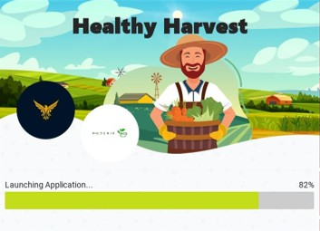<br><br>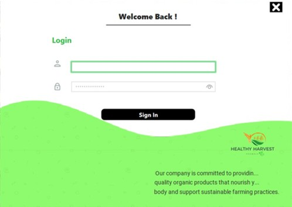 |
| **2. Employee Management & QR Generation**<br>The HR module handles full CRUD operations for staff records, including profile picture rendering. The system automatically generates unique IDs and corresponding **QR Codes** to be printed on physical company ID cards. | 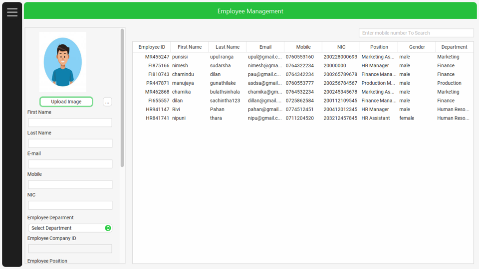<br><br>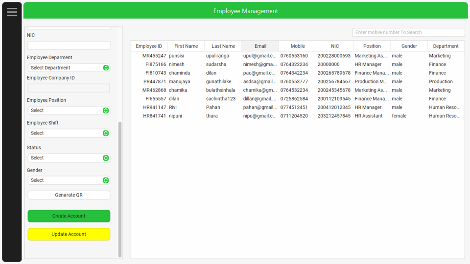 |
| **3. Live QR Attendance (Hardware Integration)**<br>The Security module utilizes the PC's webcam to scan employee ID cards. It captures real-time data for "Arrival" and "Leave" times, automatically syncing with the central database to eliminate manual clock-ins.<br><br>*(Tech: ZXing Library, Webcam Capture API)* | 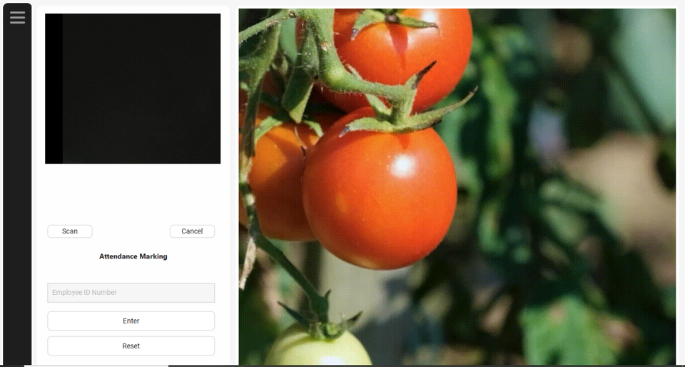<br><br> |
| **4. Attendance Tracking & Data Export**<br>HR can review all webcam-captured attendance records, manually override entries if necessary, filter by date ranges, and instantly export the data into a formatted spreadsheet for external auditing.<br><br>*(Tech: Apache POI for .xlsx generation)* | 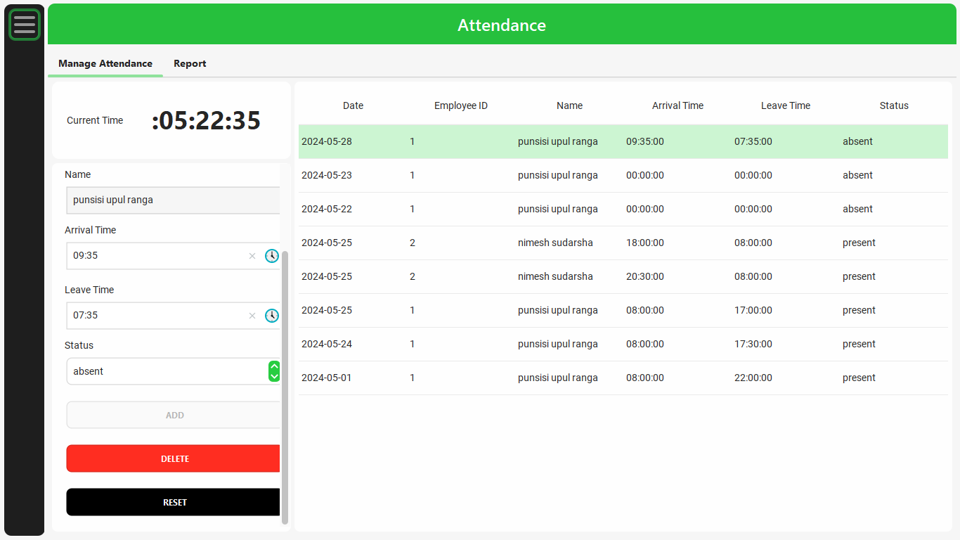<br><br>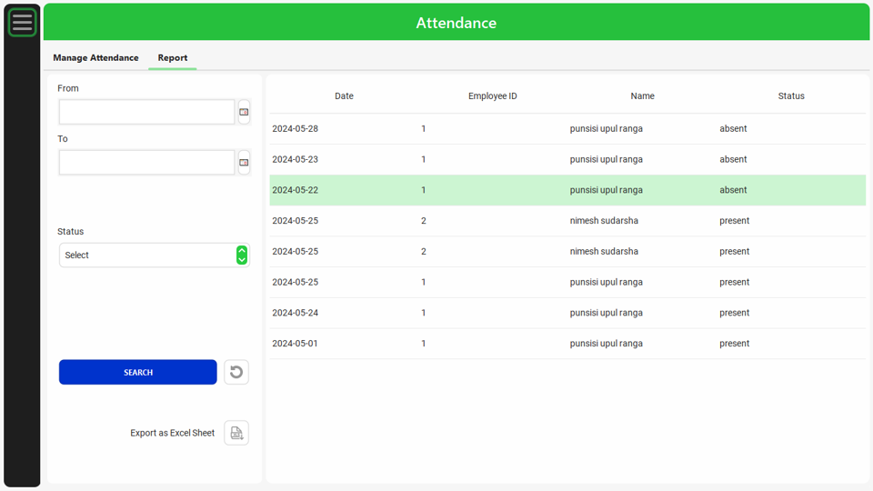 |
| **5. Employee Training Allocation**<br>A dedicated sub-module for HR to create internal training programs, assign instructors, set timelines, and batch-assign employees to specific courses to track their professional development. | 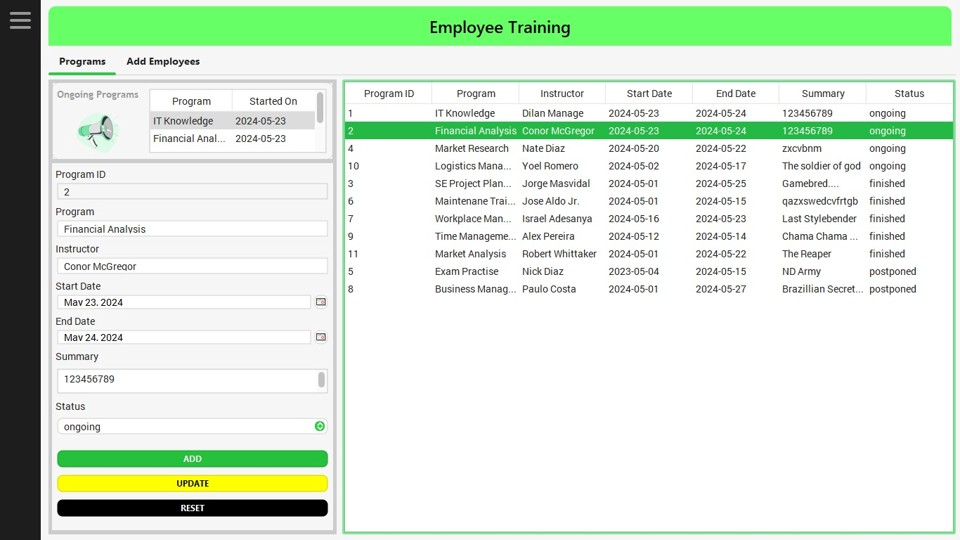<br><br>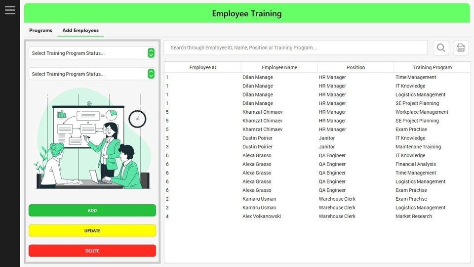 |
| **6. Production & Inventory Control**<br>Product Managers can define new agricultural categories (Fruits, Vegetables, Nuts), register new products, and input bulk stock data (quantity, physical units like Kg/Packets, and precise arrival times) into the centralized database. | 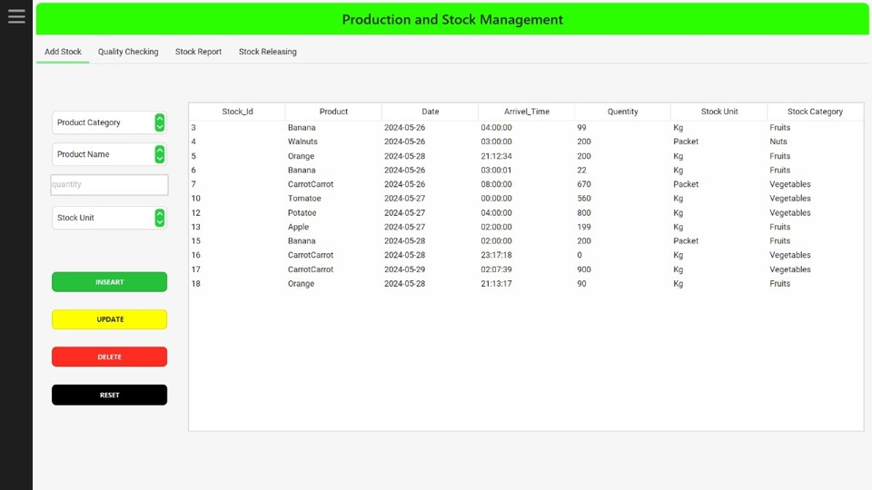<br><br>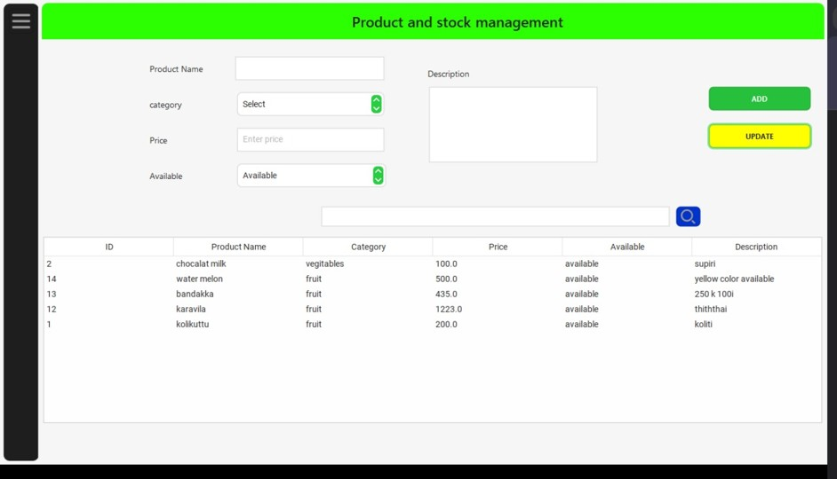 |
| **7. Quality Assurance (QA) & Stock Reporting**<br>Before any harvest can be sold, it must pass a strict digital QA checklist evaluating Color, Weight, Size, and Packing Quality to determine its Approval Status. Managers can instantly view approved stock and use the **Export as Excel Sheet** feature for external audits.<br><br>*(Tech: Apache POI / poi-ooxml)* | 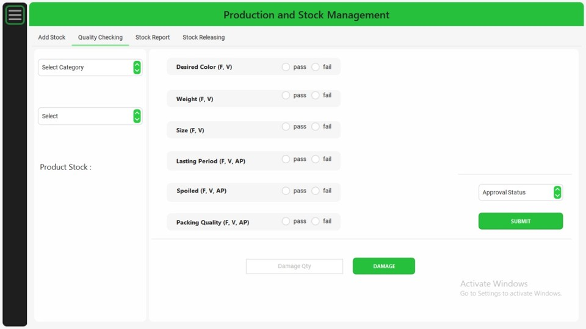<br><br>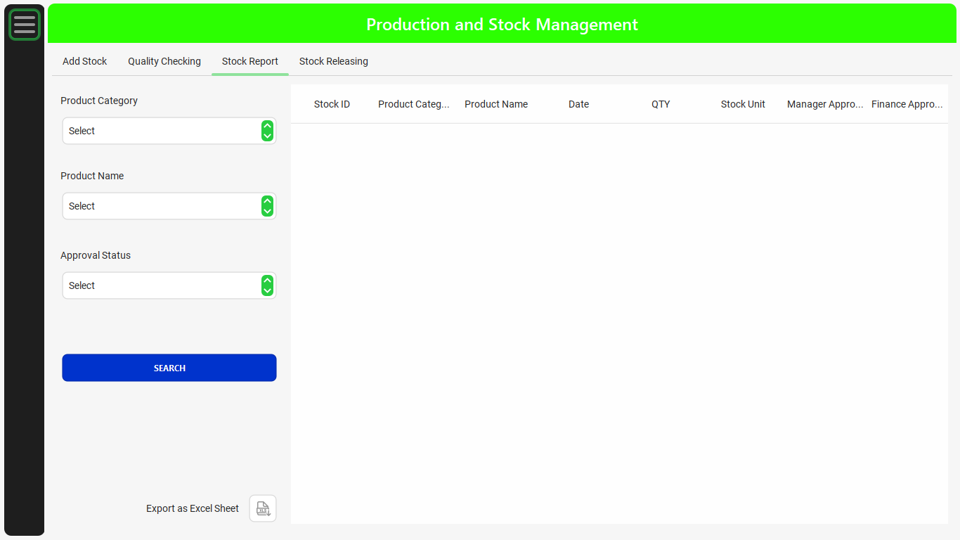 |
| **8. Stock Releasing & Sales Invoicing**<br>Finance and Product managers handle the final release of stock by attaching buyer details, tracking paid amounts, and logging financial/managerial approval timestamps before generating final release invoices. | 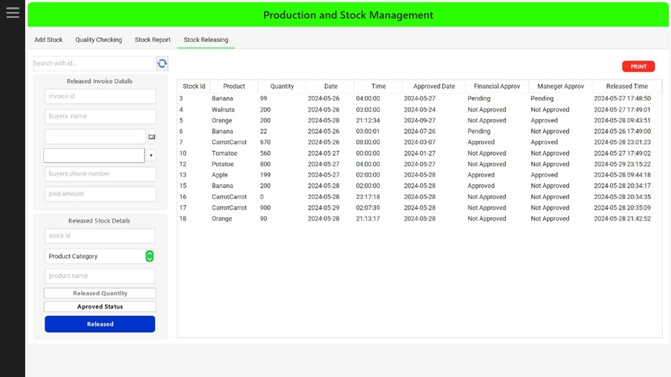<br><br>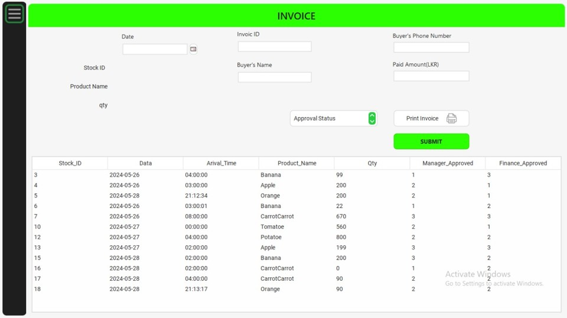 |
| **9. Automated Payroll Processing**<br>An automated financial engine that calculates an employee's Net Salary by dynamically factoring in Base Salary, overtime (OT) hours, allowances, No-Pay days, and standard **EPF deductions (8%)**. HR can also filter historical payroll data by specific date ranges. | 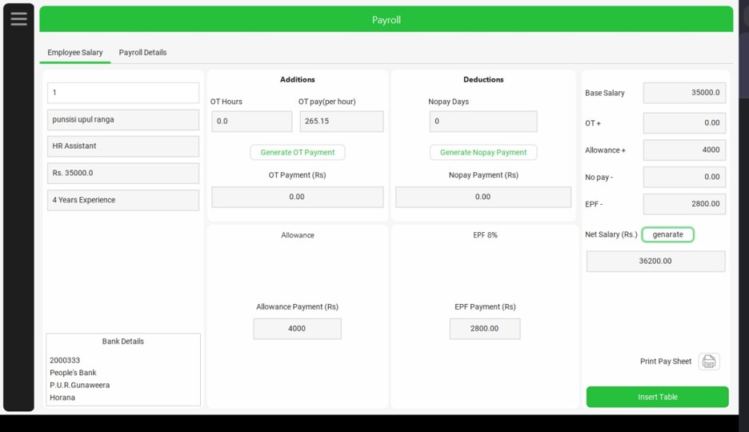<br><br>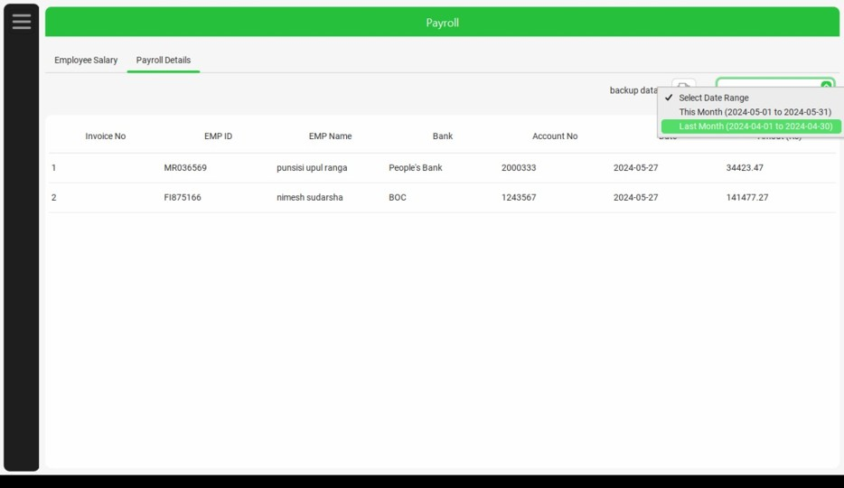 |
| **10. Enterprise Document Generation**<br>The system compiles complex database queries into professional, printable PDF documents on the fly. This includes individual **Pay Advice (Payslips)** for employees and detailed **Approved Stock / Invoices** for managerial sign-off.<br><br>*(Tech: JasperReports 6.20 & JasperViewer)* | 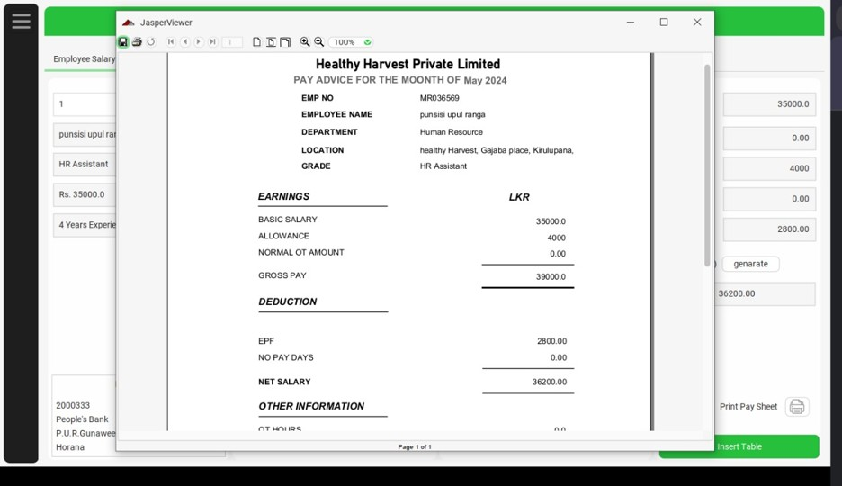<br><br>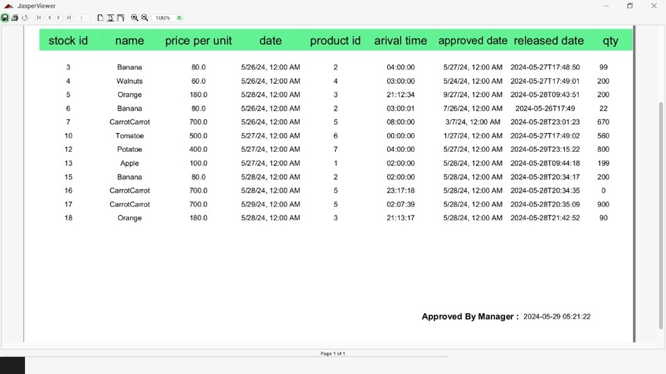 |

---

## ⚙️ Local Setup & Installation

1. **Clone the repository:**
   ```bash
   git clone [https://github.com/dilansachcha/Healthy-Harvest.git](https://github.com/dilansachcha/Healthy-Harvest.git)
   ```
2. **Database Setup:**
   * Install and Setup MySQL Server.
   * Create a database named `healthy_harvest`.
   * Allow the application to generate the tables.
3. **Configure Database Credentials:**
   * Navigate to `src/com/model/MySQL.java` and update the database username and password to match your local MySQL configuration.
4. **Resolve Dependencies:**
   * Open the project in Apache NetBeans.
   * Ensure all JAR files located in the `Libraries` folder (FlatLaf, JasperReports, ZXing, Webcam-Capture, etc.) are properly added to the project's Build Path.
5. **Run the Application:**
   * Build and run the main class (Splash screen / Login).
